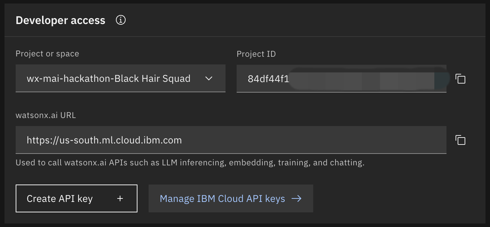
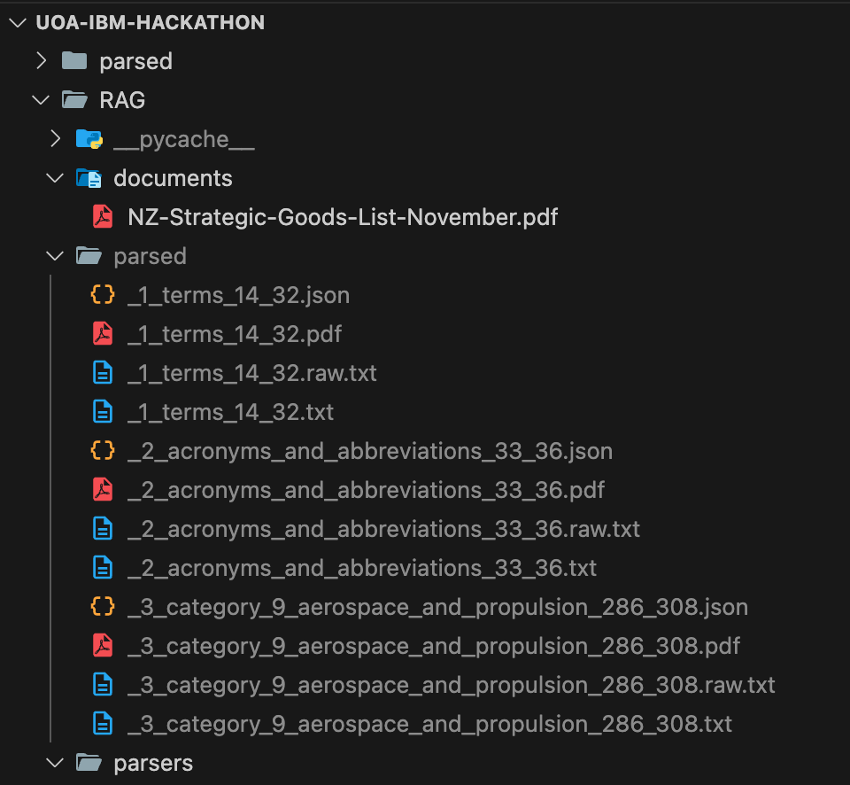

# MAI - COMPSCI 714 Hackathon - Back Hair Squad

### 1. Setup environment

create `.env` with following variables.

You can open `.env.sample`

```(.env)
WATSONX_API_KEY=Your-API-Key-Here
WATSONX_URL=https://us-south.ml.cloud.ibm.com
WATSONX_PROJECT_ID=Your-Project-ID-Here
```

You can find values in ibm cloud


### 2. Extract text from NEW ZEALAND STRATEGIC GOODS LIST November 2024 document

```(bash)
# run this command
python ./RAG/extractor.py
```

Then you can see a list of documents approriated to the parts of the original document.


Now, open `agenctic_rag.ipynb` to try to call agent
